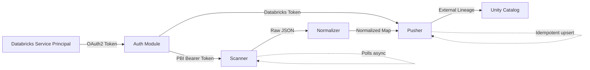
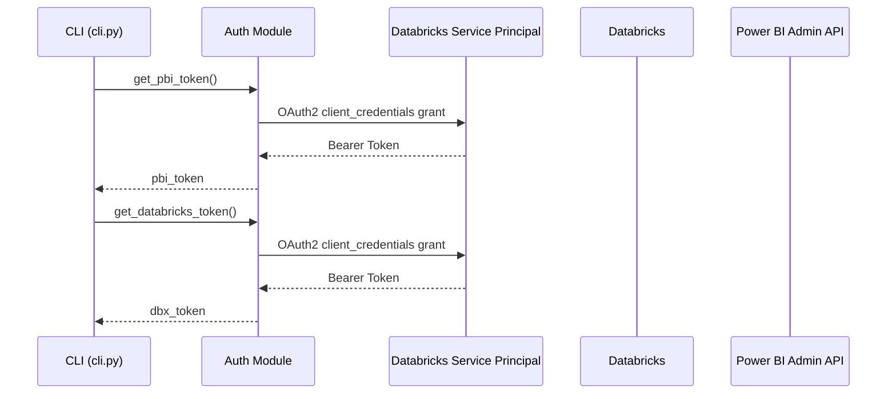

# Defensive Lineage — Architecture

## System Overview

Defensive Lineage is a Python CLI tool that bridges the lineage gap between Power BI and Databricks Unity Catalog. It extracts certified Power BI asset metadata, transforms it into a normalized dependency map, and injects it into Unity Catalog's lineage graph via the External Metadata (BYOL) API.

```
┌─────────────────┐        ┌──────────────────┐       ┌─────────────────────┐
│   Power BI      │        │  Defensive        │       │  Databricks Unity   │
│   Tenant        │──────▶   Lineage (Python) │──────▶│  Catalog            │
│                 │  REST  │                  │  REST  │                     │
│  Scanner API    │  JSON  │  Transform Layer │  JSON  │  BYOL / External    │
│  (Admin v1.0)   │        │                  │       │  Metadata API       │
└─────────────────┘        └──────────────────┘       └─────────────────────┘
```

## Data Flow



## Module Responsibilities

### `auth.py` — Authentication
**Single Responsibility:** Acquire and cache access tokens for both platforms.

- Uses the **Databricks SDK** (`databricks-sdk`) to authenticate via a Databricks Service Principal
- The same SP identity is used to obtain a Bearer token for the Power BI Admin API
- Reads credentials from environment variables (never hardcoded)
- Returns plain bearer token strings — no HTTP logic lives here
- Token caching: reuses tokens until expiry, refreshes automatically

### `scanner.py` — Power BI Metadata Extraction
**Single Responsibility:** Interact with the Power BI Admin Scanner API and return raw JSON.

- Implements the 3-step async scan flow:
  1. **Trigger:** `POST /admin/workspaces/getInfo` with `lineage=True`, `datasourceDetails=True`
  2. **Poll:** `GET /admin/workspaces/scanStatus/{scanId}` until status is `Succeeded`
  3. **Fetch:** `GET /admin/workspaces/scanResult/{scanId}`
- Handles pagination across multiple workspaces
- Filters results to only include **Certified** and **Promoted** endorsements
- Returns raw Python dicts — no transformation logic lives here

### `transform.py` — Data Normalization
**Single Responsibility:** Convert raw Power BI JSON into a clean, schema-validated dependency map.

- Input: Raw Scanner API JSON (nested, inconsistent structure)
- Output: List of `LineageMapping` objects (flat, validated)
- Handles edge cases:
  - Multi-source datasets (one PBI dataset → multiple Databricks tables)
  - Cross-workspace dataset references
  - Missing lineage metadata (logs warning, skips gracefully)
- **Zero HTTP calls** — this module is pure data transformation
- Fully unit-testable with static JSON fixtures

### `push.py` — Databricks Lineage Injection
**Single Responsibility:** Write lineage mappings into Unity Catalog via the BYOL API.

- Creates external asset nodes for Power BI reports/dashboards
- Links external nodes to existing Unity Catalog table entries
- Idempotent: re-running updates existing links, does not create duplicates
- Supports `--dry-run` mode (logs intended changes without making API calls)
- Handles rate limiting and retries with exponential backoff

### `cli.py` — Command-Line Interface
**Single Responsibility:** Parse user arguments and orchestrate the pipeline.

- Built with `click`
- Commands:
  - `defensive-lineage scan` — Run only the PBI extraction
  - `defensive-lineage push` — Run only the Databricks push (from a local JSON file)
  - `defensive-lineage sync` — Run the full pipeline end-to-end
  - `defensive-lineage dry-run` — Full pipeline without writing to Databricks
- Handles logging configuration and exit codes

## Data Schema

### `LineageMapping` (Core Data Model)

```python
from pydantic import BaseModel

class LineageMapping(BaseModel):
    """A single dependency link between a PBI report and a Databricks table."""

    # Power BI side
    pbi_workspace_id: str
    pbi_workspace_name: str
    pbi_report_id: str
    pbi_report_name: str
    pbi_dataset_id: str
    pbi_dataset_name: str
    endorsement: str  # "Certified" | "Promoted"
    connection_mode: str  # "DirectQuery" | "Import" | "Unknown"

    # Databricks side
    databricks_catalog: str
    databricks_schema: str
    databricks_table: str
    columns: list[str]
```

## Authentication Flow



## Error Handling Strategy

| Layer | Error Type | Behavior |
|-------|-----------|----------|
| Auth | Invalid credentials | Raise `AuthenticationError`, exit with code 1 |
| Auth | Token expired mid-run | Auto-refresh via Databricks SDK token cache |
| Scanner | API rate limit (429) | Retry with exponential backoff (max 3 retries) |
| Scanner | Scan timeout | Raise `ScanTimeoutError` after configurable max wait |
| Transform | Missing lineage data | Log warning, skip asset, continue processing |
| Transform | Schema validation fail | Log error with asset ID, skip asset |
| Push | Databricks API error | Log error, skip single mapping, continue batch |
| Push | Network failure | Retry with backoff, then raise `PushError` |

## Configuration

All configuration is via environment variables (12-factor app style):

| Variable | Required | Description |
|----------|----------|--------------|
| `DATABRICKS_HOST` | Yes | Databricks workspace URL |
| `DATABRICKS_CLIENT_ID` | Yes | Databricks Service Principal client ID |
| `DATABRICKS_CLIENT_SECRET` | Yes | Databricks Service Principal client secret |
| `DL_LOG_LEVEL` | No | Logging level (default: `INFO`) |
| `DL_SCAN_TIMEOUT` | No | Max seconds to wait for PBI scan (default: `300`) |
| `DL_DRY_RUN` | No | Set to `true` to disable writes (default: `false`) |
