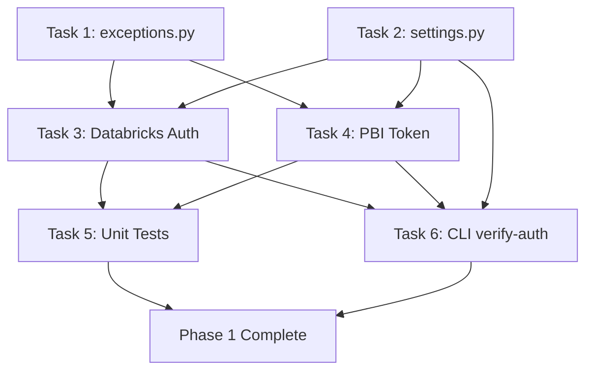

# Phase 1 Implementation Plan: Authentication Layer ("The Bouncer")

> **Phase Goal:** Prove we can authenticate to both Power BI and Databricks using environment-based credentials, returning valid bearer tokens for each platform.

---

## Prerequisites

- [x] Python 3.14 virtual environment created (`venv`)
- [x] All dependencies installed (`pip install -e ".[dev]"`)
- [x] `pyproject.toml` configured with correct target versions
- [x] `.env` file populated with valid credentials:
  - `AZURE_TENANT_ID`, `AZURE_CLIENT_ID`, `AZURE_CLIENT_SECRET` (for Power BI)
  - `DATABRICKS_HOST`, `DATABRICKS_CLIENT_ID`, `DATABRICKS_CLIENT_SECRET` (for Databricks)
- [x] Entra ID App Registration created and added to PBI-enabled security group
- [x] Databricks Service Principal provisioned with Unity Catalog permissions

---

## Current State of Codebase

| File | Status | Notes |
|------|--------|-------|
| `auth.py` | Skeleton | `get_databricks_client()` returns bare `WorkspaceClient()`, `get_pbi_token()` returns placeholder string |
| `cli.py` | Skeleton | Click group with stub commands (`scan`, `push`, `sync`), loads `.env` |
| `transform.py` | Skeleton | `LineageMapping` model (partial fields), empty `normalize_pbi_json()` |
| `scanner.py` | Skeleton | Three stub functions returning hardcoded values |
| `push.py` | Skeleton | Stub `push_lineage()` that only logs |
| `test_auth.py` | Placeholder | Single `assert True` |

---

## Tasks

### Task 1: Create Custom Exceptions Module

- **Description:** Create `src/defensive_lineage/exceptions.py` with project-specific exception classes. Phase 1 needs `AuthenticationError`. Future phases will add `ScanTimeoutError`, `PushError`, etc.
- **Module:** `src/defensive_lineage/exceptions.py` (new file)
- **Input/Output:**
  - Input: N/A (defines exception types only)
  - Output: Importable exception classes
- **Implementation Details:**
  ```python
  class DefensiveLineageError(Exception):
      """Base exception for all Defensive Lineage errors."""

  class AuthenticationError(DefensiveLineageError):
      """Raised when authentication to any platform fails."""
  ```
- **Acceptance Criteria:**
  - [ ] `exceptions.py` exists with `DefensiveLineageError` base class
  - [ ] `AuthenticationError` subclasses `DefensiveLineageError`
  - [ ] All classes have Google-style docstrings
  - [ ] `from __future__ import annotations` at top
  - [ ] `mypy --strict` passes on the file
- **Risks:** None — this is pure Python with no external dependencies.
- **Estimated Time:** 0.5 hours
- **Depends On:** None

---

### Task 2: Create Settings Module (Pydantic Configuration)

- **Description:** Create `src/defensive_lineage/settings.py` using Pydantic `BaseModel` to validate and centralize all environment variables. This replaces scattered `os.getenv()` calls with a single validated config object. We use `python-dotenv` (already a dependency) to load `.env`, then pass values into Pydantic for validation.
- **Module:** `src/defensive_lineage/settings.py` (new file)
- **Input/Output:**
  - Input: Environment variables (loaded from `.env` or system env)
  - Output: A validated `Settings` object with typed fields
- **Implementation Details:**
  ```python
  class Settings(BaseModel):
      """Validated configuration loaded from environment variables."""

      # Azure / Power BI
      azure_tenant_id: str
      azure_client_id: str
      azure_client_secret: str

      # Databricks
      databricks_host: str
      databricks_client_id: str
      databricks_client_secret: str

      # App Settings (with defaults)
      dl_log_level: str = "INFO"
      dl_scan_timeout: int = 300
      dl_dry_run: bool = False

  def load_settings() -> Settings:
      """Load and validate settings from environment variables."""
  ```
- **Acceptance Criteria:**
  - [ ] `settings.py` exists with a `Settings` Pydantic model
  - [ ] `load_settings()` function reads env vars via `os.environ` (after `dotenv` loads them in CLI)
  - [ ] Raises `ValidationError` with a clear message if any required var is missing
  - [ ] All optional fields have sensible defaults matching `ARCHITECTURE.md`
  - [ ] `mypy --strict` passes
  - [ ] No direct I/O — only reads from `os.environ` dict
- **Risks:**
  - Risk: `pydantic-settings` is not in our deps (and we shouldn't add it). Mitigation: Use plain `BaseModel` + a factory function that reads `os.environ`.
- **Estimated Time:** 1 hour
- **Depends On:** None (parallel with Task 1)

---

### Task 3: Implement Databricks Authentication

- **Description:** Flesh out `get_databricks_client()` in `auth.py` to accept a `Settings` object and return an authenticated `WorkspaceClient`. The Databricks SDK handles OAuth2 M2M automatically when `host`, `client_id`, and `client_secret` are provided.
- **Module:** `src/defensive_lineage/auth.py`
- **Input/Output:**
  - Input: `Settings` object (from Task 2)
  - Output: Authenticated `WorkspaceClient` instance
- **Implementation Details:**
  ```python
  def get_databricks_client(settings: Settings) -> WorkspaceClient:
      """Initialize an authenticated Databricks WorkspaceClient.

      Uses OAuth2 M2M (client_credentials) via the Databricks SDK.
      The SDK handles token acquisition and caching automatically.

      Args:
          settings: Validated application settings.

      Returns:
          An authenticated WorkspaceClient.

      Raises:
          AuthenticationError: If the client cannot authenticate.
      """
      try:
          client = WorkspaceClient(
              host=settings.databricks_host,
              client_id=settings.databricks_client_id,
              client_secret=settings.databricks_client_secret,
          )
          # Validate by making a lightweight API call
          client.current_user.me()
          return client
      except Exception as exc:
          raise AuthenticationError(f"Databricks auth failed: {exc}") from exc
  ```
- **Acceptance Criteria:**
  - [ ] `get_databricks_client()` accepts a `Settings` parameter
  - [ ] Returns a `WorkspaceClient` configured with SP credentials
  - [ ] Validates connectivity with `client.current_user.me()`
  - [ ] Wraps SDK exceptions into `AuthenticationError`
  - [ ] Logs success at `INFO` and failure at `ERROR`
  - [ ] `mypy --strict` passes
- **Risks:**
  - Risk: The Databricks SP may not have permission to call `current_user.me()`. Mitigation: Fall back to `client.workspace.get_status("/")` as the validation call, or skip validation and let downstream calls surface auth issues.
  - Risk: Network connectivity issues during development. Mitigation: All tests mock the SDK (see Task 5).
- **Estimated Time:** 1.5 hours
- **Depends On:** Task 1 (exceptions), Task 2 (settings)

---

### Task 4: Implement Power BI Token Acquisition

- **Description:** Implement `get_pbi_token()` in `auth.py` to acquire an OAuth2 bearer token from Microsoft Entra ID using the client credentials flow. Uses `requests.post()` directly against the Entra token endpoint — **no `azure-identity` or `msal` dependency** (keeping the dep list minimal per CONVENTIONS.md).
- **Module:** `src/defensive_lineage/auth.py`
- **Input/Output:**
  - Input: `Settings` object (provides `azure_tenant_id`, `azure_client_id`, `azure_client_secret`)
  - Output: Bearer token string
- **Implementation Details:**
  ```python
  PBI_SCOPE = "https://analysis.windows.net/powerbi/api/.default"
  ENTRA_TOKEN_URL = "https://login.microsoftonline.com/{tenant_id}/oauth2/v2.0/token"

  def get_pbi_token(settings: Settings) -> str:
      """Acquire a bearer token for the Power BI Admin API.

      Performs an OAuth2 client_credentials grant against Microsoft
      Entra ID. The returned token is scoped to the Power BI API.

      Args:
          settings: Validated application settings.

      Returns:
          A bearer token string.

      Raises:
          AuthenticationError: If the token request fails.
      """
      url = ENTRA_TOKEN_URL.format(tenant_id=settings.azure_tenant_id)
      payload = {
          "grant_type": "client_credentials",
          "client_id": settings.azure_client_id,
          "client_secret": settings.azure_client_secret,
          "scope": PBI_SCOPE,
      }
      response = requests.post(url, data=payload, timeout=30)

      if response.status_code != 200:
          raise AuthenticationError(
              f"PBI token request failed ({response.status_code}): {response.text}"
          )

      token = response.json().get("access_token")
      if not token:
          raise AuthenticationError("PBI token response missing 'access_token' field")

      return token
  ```
- **Acceptance Criteria:**
  - [ ] `get_pbi_token()` accepts a `Settings` parameter
  - [ ] Makes a `POST` to `https://login.microsoftonline.com/{tenant}/oauth2/v2.0/token`
  - [ ] Uses scope `https://analysis.windows.net/powerbi/api/.default`
  - [ ] Returns a raw token string on success
  - [ ] Raises `AuthenticationError` on HTTP errors (4xx, 5xx)
  - [ ] Raises `AuthenticationError` if response JSON lacks `access_token`
  - [ ] Has a `timeout=30` on the request
  - [ ] Logs success at `INFO` (token prefix only, never full token) and failure at `ERROR`
  - [ ] `mypy --strict` passes
  - [ ] **No new dependencies** — uses only `requests` (already in deps)
- **Risks:**
  - Risk: Entra ID App Registration not configured correctly → 401/403 from token endpoint. Mitigation: Error message includes full response body for debugging. Document required Entra setup in `PREREQUISITES.md`.
  - Risk: `azure_tenant_id` in `.env` might be wrong or the app lacks PBI API permissions. Mitigation: Clear error message guides user to check Entra portal.
  - Risk: Token caching — this implementation fetches a new token on every call. Mitigation: Acceptable for Phase 1 (single-shot CLI). Can add `functools.lru_cache` or TTL cache in Phase 2+ if needed.
- **Estimated Time:** 2 hours
- **Depends On:** Task 1 (exceptions), Task 2 (settings)

---

### Task 5: Write Unit Tests for Auth Module

- **Description:** Write comprehensive tests for all auth functions. Tests must **never hit real APIs** — use `responses` library to mock HTTP calls, and `unittest.mock` to mock the Databricks SDK.
- **Module:** `tests/test_auth.py`, `tests/test_settings.py`
- **Input/Output:**
  - Input: Mocked HTTP responses and SDK behavior
  - Output: Passing test suite with happy-path and error-path coverage
- **Test Cases:**

  | # | Test Function | Scenario |
  |---|--------------|----------|
  | 1 | `test_get_pbi_token_returns_valid_token` | Mock Entra returns 200 with `access_token` → function returns the token |
  | 2 | `test_get_pbi_token_raises_on_401` | Mock Entra returns 401 → raises `AuthenticationError` |
  | 3 | `test_get_pbi_token_raises_on_missing_token` | Mock Entra returns 200 but no `access_token` field → raises `AuthenticationError` |
  | 4 | `test_get_pbi_token_raises_on_network_error` | Mock a `ConnectionError` → raises `AuthenticationError` |
  | 5 | `test_get_pbi_token_uses_correct_scope` | Assert the POST body contains `scope=https://analysis.windows.net/powerbi/api/.default` |
  | 6 | `test_get_databricks_client_returns_client` | Mock `WorkspaceClient` + `current_user.me()` → returns client |
  | 7 | `test_get_databricks_client_raises_on_auth_failure` | Mock `WorkspaceClient` raising exception → raises `AuthenticationError` |
  | 8 | `test_load_settings_with_all_vars` | Set all env vars → returns valid `Settings` |
  | 9 | `test_load_settings_raises_on_missing_required` | Omit `DATABRICKS_HOST` → raises `ValidationError` |
  | 10 | `test_load_settings_uses_defaults` | Omit optional vars → defaults are applied |

- **Acceptance Criteria:**
  - [ ] All 10 test cases implemented and passing
  - [ ] No real HTTP requests are made (verified by `responses` strict mode)
  - [ ] No real Databricks SDK calls (mocked via `unittest.mock.patch`)
  - [ ] Test naming follows convention: `test_<function>_<scenario>()`
  - [ ] `pytest tests/test_auth.py tests/test_settings.py -v` passes with 0 failures
  - [ ] `mypy --strict` passes on the test files
- **Risks:**
  - Risk: Mocking the Databricks SDK internals may be fragile if the SDK changes its interface. Mitigation: Mock at the `WorkspaceClient` constructor level, not internals.
- **Estimated Time:** 2 hours
- **Depends On:** Task 3 (Databricks auth), Task 4 (PBI auth)

---

### Task 6: CLI `verify-auth` Command

- **Description:** Add a `verify-auth` command to `cli.py` that loads settings, acquires both tokens, and prints a success/failure summary. This is the "Definition of Done" deliverable from the ROADMAP.
- **Module:** `src/defensive_lineage/cli.py`
- **Input/Output:**
  - Input: Environment variables (via `.env`)
  - Output: Human-readable stdout summary showing auth status for both platforms
- **Implementation Details:**
  ```
  $ defensive-lineage verify-auth
  ✓ Settings loaded from environment
  ✓ Databricks authenticated (workspace: https://adb-xxxx.azuredatabricks.net)
  ✓ Power BI token acquired (expires in 3599s)
  
  All systems authenticated successfully.
  ```
  On failure:
  ```
  $ defensive-lineage verify-auth
  ✓ Settings loaded from environment
  ✗ Databricks authentication failed: 401 Unauthorized
  ✗ Power BI token acquisition failed: invalid_client
  
  Authentication failed. See errors above.
  ```
- **Acceptance Criteria:**
  - [ ] `defensive-lineage verify-auth` command exists
  - [ ] Loads settings via `load_settings()`
  - [ ] Attempts Databricks auth via `get_databricks_client()`
  - [ ] Attempts PBI auth via `get_pbi_token()`
  - [ ] Prints clear ✓/✗ status for each platform
  - [ ] Returns exit code 0 on full success, exit code 1 on any failure
  - [ ] Uses `click.echo()` for output (per CONVENTIONS.md — `print()` only in CLI)
  - [ ] Catches `AuthenticationError` gracefully (does not dump stack traces to user)
- **Risks:**
  - Risk: If both services are down or misconfigured, user gets two failure messages. Mitigation: This is intentional — show all failures, not just the first one.
- **Estimated Time:** 1 hour
- **Depends On:** Task 2 (settings), Task 3 (Databricks auth), Task 4 (PBI auth)

---

## Execution Order



**Parallel tracks:**
1. **Task 1 + Task 2** can be built simultaneously (no interdependency)
2. **Task 3 + Task 4** can be built simultaneously (both depend on T1+T2 only)
3. **Task 5 + Task 6** can be built simultaneously (both depend on T3+T4)

**Critical path:** T1 → T3 → T5 → Done (or T2 → T4 → T5 → Done)

---

## Risk Assessment Summary

| Risk | Likelihood | Impact | Mitigation |
|------|-----------|--------|------------|
| Entra ID app not configured for PBI API access | Medium | Blocks Task 4 | Validate prerequisites checklist before starting; clear error messages guide user to Entra portal |
| Databricks SP lacks permissions for `current_user.me()` | Low | Blocks Task 3 validation step | Use alternative lightweight API call; or skip validation and rely on downstream errors |
| Token caching not implemented | N/A | Low (Phase 1 is single-shot) | Acceptable for Phase 1; add caching in Phase 2 when scanner needs tokens across multiple calls |
| `responses` library mocking doesn't cover all edge cases | Low | Test gaps | Supplement with `unittest.mock` for non-HTTP paths |
| Python 3.14 compatibility issues with deps | Low | Blocks everything | All deps already installed and working in venv |

---

## Files Changed Summary

| File | Action | Task |
|------|--------|------|
| `src/defensive_lineage/exceptions.py` | **Create** | Task 1 |
| `src/defensive_lineage/settings.py` | **Create** | Task 2 |
| `src/defensive_lineage/auth.py` | **Modify** | Task 3, Task 4 |
| `src/defensive_lineage/cli.py` | **Modify** | Task 6 |
| `tests/test_auth.py` | **Rewrite** | Task 5 |
| `tests/test_settings.py` | **Create** | Task 5 |

---

## Total Estimated Time

| Task | Hours |
|------|-------|
| Task 1: Exceptions | 0.5 |
| Task 2: Settings | 1.0 |
| Task 3: Databricks Auth | 1.5 |
| Task 4: PBI Token | 2.0 |
| Task 5: Unit Tests | 2.0 |
| Task 6: CLI verify-auth | 1.0 |
| **Total** | **8.0** |

This aligns with the ROADMAP estimate of **5–8 hours** for Phase 1.

---

## Definition of Done (from ROADMAP)

> Running `defensive-lineage verify-auth` prints valid authentication status for both platforms without any manual browser login.

When all 6 tasks pass their acceptance criteria and `pytest` + `mypy --strict` are green, Phase 1 is complete.
