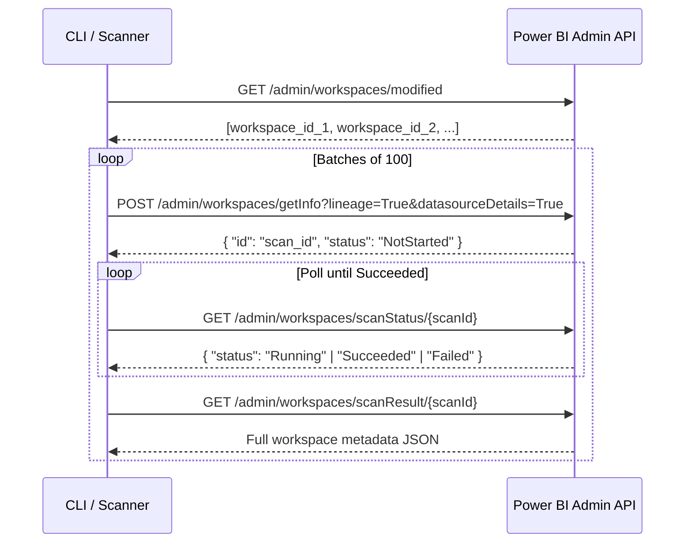
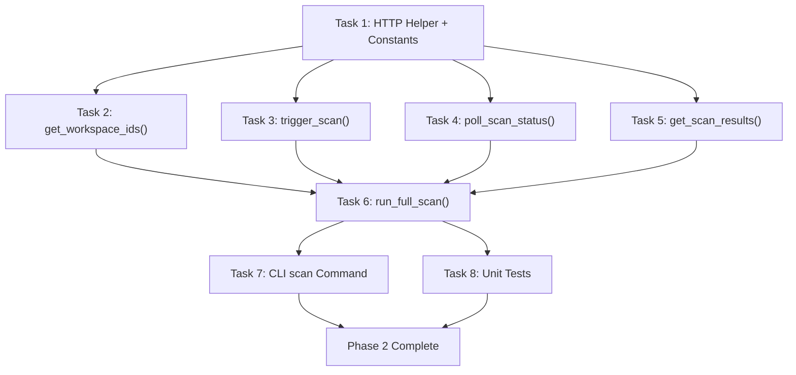

# Phase 2 Implementation Plan: Power BI Scanner API ("The Extraction")

> **Phase Goal:** Pull structured workspace metadata from Power BI — including report-to-dataset-to-table-to-column lineage — and save raw JSON locally for debugging and downstream processing.

---

## Prerequisites

- [x] Phase 1 complete — `auth.py` produces valid PBI tokens via `get_pbi_token()`
- [x] Phase 1 verified — `defensive-lineage verify-auth` returns ✓ for both platforms
- [ ] Entra ID tenant setting enabled: **"Enhance admin APIs responses with detailed metadata"** (needed for table/column info from scanner)
- [ ] At least one PBI workspace contains assets with **Certified** or **Promoted** endorsement

---

## Scanner API Flow

The Power BI Scanner API uses a **4-step async pattern**:



### API Endpoints

| Step | Method | Endpoint | Limit |
|------|--------|----------|-------|
| 1. List workspaces | `GET` | `/admin/workspaces/modified` | 30 req/hr |
| 2. Trigger scan | `POST` | `/admin/workspaces/getInfo?lineage=True&datasourceDetails=True&datasetSchema=True` | 500 req/hr, max 100 workspace IDs |
| 3. Poll status | `GET` | `/admin/workspaces/scanStatus/{scanId}` | — |
| 4. Fetch results | `GET` | `/admin/workspaces/scanResult/{scanId}` | 500 req/hr, results available 24hrs |

### Key Query Parameters for `getInfo`

| Parameter | Value | Why |
|-----------|-------|-----|
| `lineage` | `True` | Returns `upstreamDataflows`, `datasourceUsages`, `datasourceInstances` |
| `datasourceDetails` | `True` | Returns `connectionDetails` with `server` and `database` info |
| `datasetSchema` | `True` | Returns `tables[].columns[]` — needed for column-level lineage |
| `datasetExpressions` | `False` | DAX/M expressions are out of scope per ROADMAP |
| `getArtifactUsers` | `False` | User permissions are out of scope |

---

## Current State of Codebase

| File | Status |
|------|--------|
| `scanner.py` | Skeleton — three stub functions (`trigger_scan`, `poll_scan_status`, `get_scan_results`) |
| `test_scanner.py` | Placeholder — single `assert True` |
| `auth.py` | ✅ Complete — `get_pbi_token()` returns valid bearer tokens |
| `settings.py` | ✅ Complete — `DL_SCAN_TIMEOUT` available (default 300s) |
| `exceptions.py` | ✅ Complete — `ScanTimeoutError` already defined |

---

## Tasks

### Task 1: Define Scanner Constants and HTTP Helper

- **Description:** Add the base URL, endpoint paths, and a reusable HTTP helper function to `scanner.py` that handles authorization headers, timeouts, HTTP error checking, and 429 rate-limit retries with exponential backoff.
- **Module:** `src/defensive_lineage/scanner.py`
- **Input/Output:**
  - Input: PBI bearer token string, endpoint URL, optional request body
  - Output: Parsed JSON response `dict`
- **Implementation Details:**
  ```python
  PBI_ADMIN_BASE_URL = "https://api.powerbi.com/v1.0/myorg/admin"

  MAX_RETRIES = 3
  INITIAL_BACKOFF_SECONDS = 2.0

  def _pbi_request(
      method: str,
      path: str,
      token: str,
      *,
      json_body: dict[str, Any] | None = None,
      params: dict[str, str] | None = None,
  ) -> dict[str, Any]:
      """Make an authenticated request to the Power BI Admin API.

      Handles 429 rate limiting with exponential backoff (max 3 retries).
      Raises on all other HTTP errors.
      """
  ```
- **Acceptance Criteria:**
  - [ ] Constants defined for base URL and all endpoint paths
  - [ ] `_pbi_request()` adds `Authorization: Bearer {token}` header
  - [ ] Returns parsed JSON on 200/202
  - [ ] Retries on 429 with exponential backoff (2s → 4s → 8s)
  - [ ] Uses `Retry-After` header from 429 responses when available
  - [ ] Raises `ScanTimeoutError` after exhausting retries
  - [ ] Logs request method, path, and status at `DEBUG`
  - [ ] Has `timeout=30` on all requests
- **Risks:**
  - Risk: 429 responses may not include `Retry-After` header. Mitigation: Fall back to exponential backoff.
- **Estimated Time:** 1.5 hours
- **Depends On:** Phase 1 (auth.py, exceptions.py)

---

### Task 2: Implement `get_workspace_ids()`

- **Description:** Implement a function that calls `GET /admin/workspaces/modified` to retrieve the list of all workspace IDs to scan. Optionally accepts a `modified_since` datetime for incremental scans. Excludes personal workspaces.
- **Module:** `src/defensive_lineage/scanner.py`
- **Input/Output:**
  - Input: PBI bearer token, optional `modified_since: datetime | None`
  - Output: `list[str]` of workspace UUID strings
- **Implementation Details:**
  ```python
  def get_workspace_ids(
      token: str,
      *,
      modified_since: datetime | None = None,
  ) -> list[str]:
      """Retrieve workspace IDs from the Power BI Admin API.

      Calls GET /admin/workspaces/modified to discover all workspaces
      in the tenant. Personal and inactive workspaces are excluded.

      Args:
          token: Power BI bearer token.
          modified_since: If provided, only returns workspaces modified
              after this datetime (UTC, ISO 8601). Must be within 30 days.

      Returns:
          A list of workspace ID strings (UUIDs).
      """
  ```
- **Acceptance Criteria:**
  - [ ] Calls correct endpoint with `excludePersonalWorkspaces=True` and `excludeInActiveWorkspaces=True`
  - [ ] Passes `modifiedSince` parameter when `modified_since` is provided
  - [ ] Returns `list[str]` of workspace IDs
  - [ ] Handles empty response (tenant with no workspaces) → returns empty list
  - [ ] Logs count of discovered workspaces at `INFO`
- **Risks:**
  - Risk: API returns workspace objects vs bare IDs depending on version. Mitigation: Handle both formats — extract `id` from objects if needed.
  - Risk: Rate limit of 30 req/hr for this endpoint. Mitigation: This is called once per run, well within limits.
- **Estimated Time:** 1 hour
- **Depends On:** Task 1 (HTTP helper)

---

### Task 3: Implement `trigger_scan()`

- **Description:** Implement the function that triggers a workspace scan by calling `POST /admin/workspaces/getInfo` with lineage and datasource parameters enabled. Handles the 100-workspace-per-request limit by batching internally.
- **Module:** `src/defensive_lineage/scanner.py`
- **Input/Output:**
  - Input: PBI bearer token, list of workspace IDs
  - Output: `list[str]` of scan IDs (one per batch)
- **Implementation Details:**
  ```python
  _MAX_WORKSPACES_PER_SCAN = 100

  def trigger_scan(token: str, workspace_ids: list[str]) -> list[str]:
      """Trigger metadata scans for the given workspaces.

      Batches workspace IDs into groups of 100 (API limit) and triggers
      a separate scan for each batch. Returns a list of scan IDs to poll.

      Args:
          token: Power BI bearer token.
          workspace_ids: List of workspace UUIDs to scan.

      Returns:
          List of scan ID strings, one per batch.

      Raises:
          ScanTimeoutError: If the API rejects the scan request.
      """
  ```
- **Acceptance Criteria:**
  - [ ] Sends `POST` to `/admin/workspaces/getInfo` with query params `lineage=True`, `datasourceDetails=True`, `datasetSchema=True`
  - [ ] Request body contains `{"workspaces": [list of IDs]}`
  - [ ] Batches IDs into groups of 100
  - [ ] Returns list of scan IDs extracted from the `id` field in each response
  - [ ] Logs each batch trigger at `INFO` with workspace count
  - [ ] Handles 202 Accepted response correctly
- **Risks:**
  - Risk: 500 req/hr limit. Mitigation: Typical tenant has <100 workspaces = 1 batch = 1 request.
  - Risk: Max 16 simultaneous requests. Mitigation: We trigger sequentially, not in parallel.
- **Estimated Time:** 1.5 hours
- **Depends On:** Task 1 (HTTP helper)

---

### Task 4: Implement `poll_scan_status()`

- **Description:** Implement polling logic that repeatedly checks `GET /admin/workspaces/scanStatus/{scanId}` until the scan reaches `Succeeded` or `Failed` status, or the configured timeout is exceeded.
- **Module:** `src/defensive_lineage/scanner.py`
- **Input/Output:**
  - Input: PBI bearer token, scan ID string, timeout in seconds
  - Output: Final status string (`"Succeeded"`)
- **Implementation Details:**
  ```python
  _POLL_INTERVAL_SECONDS = 5

  def poll_scan_status(
      token: str,
      scan_id: str,
      *,
      timeout_seconds: int = 300,
  ) -> str:
      """Poll the status of a Power BI scan until completion or timeout.

      Checks the scan status every 5 seconds. Raises if the scan fails
      or exceeds the timeout.

      Args:
          token: Power BI bearer token.
          scan_id: The scan ID returned by trigger_scan().
          timeout_seconds: Maximum seconds to wait (from settings.dl_scan_timeout).

      Returns:
          The final status string ("Succeeded").

      Raises:
          ScanTimeoutError: If the scan exceeds the timeout.
          ScanTimeoutError: If the scan status is "Failed".
      """
  ```
- **Acceptance Criteria:**
  - [ ] Polls `GET /admin/workspaces/scanStatus/{scanId}` every 5 seconds
  - [ ] Returns `"Succeeded"` when scan completes
  - [ ] Raises `ScanTimeoutError` if elapsed time exceeds `timeout_seconds`
  - [ ] Raises `ScanTimeoutError` if scan status is `"Failed"` (with error detail from API)
  - [ ] Logs status transitions at `INFO` (e.g., `NotStarted → Running`)
  - [ ] Uses `time.monotonic()` for accurate timeout tracking
- **Risks:**
  - Risk: Scan could take several minutes for large tenants. Mitigation: Configurable timeout via `DL_SCAN_TIMEOUT` env var (default 300s).
  - Risk: API returns unexpected status values. Mitigation: Log unrecognized statuses as `WARNING` and continue polling.
- **Estimated Time:** 1.5 hours
- **Depends On:** Task 1 (HTTP helper)

---

### Task 5: Implement `get_scan_results()`

- **Description:** Implement the function that fetches completed scan results from `GET /admin/workspaces/scanResult/{scanId}` and returns the raw workspace metadata JSON. Includes filtering to retain only workspaces containing at least one **Certified** or **Promoted** endorsed asset.
- **Module:** `src/defensive_lineage/scanner.py`
- **Input/Output:**
  - Input: PBI bearer token, scan ID string
  - Output: `dict[str, Any]` — raw API response containing workspaces with endorsed assets
- **Implementation Details:**
  ```python
  _ENDORSED_STATUSES = frozenset({"Certified", "Promoted"})

  def get_scan_results(token: str, scan_id: str) -> dict[str, Any]:
      """Fetch scan results and filter to endorsed assets.

      Downloads the full scan result and removes workspaces/datasets/reports
      that do not have a Certified or Promoted endorsement. The raw JSON
      structure is preserved for downstream processing by transform.py.

      Args:
          token: Power BI bearer token.
          scan_id: A completed scan ID.

      Returns:
          Filtered scan result dict. Contains key "workspaces" with the list
          of workspace objects, and "datasourceInstances" at the top level.
      """
  ```
- **Acceptance Criteria:**
  - [ ] Calls `GET /admin/workspaces/scanResult/{scanId}`
  - [ ] Returns the full response dict on success
  - [ ] Filters datasets to only include those with `endorsementDetails.endorsement` in `{"Certified", "Promoted"}`
  - [ ] Filters reports similarly via their `endorsementDetails`
  - [ ] Logs the count of total vs. endorsed assets at `INFO`
  - [ ] Preserves `datasourceInstances` at the top level (needed by transform.py to resolve connection details)
- **Risks:**
  - Risk: Results are only available for 24 hours after scan completion. Mitigation: We always fetch immediately after polling succeeds.
  - Risk: Some datasets may lack `endorsementDetails` entirely. Mitigation: Treat missing field as "not endorsed" → skip.
- **Estimated Time:** 2 hours
- **Depends On:** Task 1 (HTTP helper), Task 4 (poll completes before fetch)

---

### Task 6: Implement `run_full_scan()` Orchestrator

- **Description:** Create a high-level orchestrator function that chains the full scan flow: discover workspaces → trigger scan → poll → fetch results. This is what the CLI `scan` command will call. Also saves raw JSON to a local file for debugging.
- **Module:** `src/defensive_lineage/scanner.py`
- **Input/Output:**
  - Input: `Settings` object
  - Output: `dict[str, Any]` — combined scan results across all batches
- **Implementation Details:**
  ```python
  def run_full_scan(settings: Settings) -> dict[str, Any]:
      """Execute the complete Power BI scan flow.

      1. Acquire PBI token
      2. Discover workspace IDs
      3. Trigger scan (batched)
      4. Poll until all scans complete
      5. Fetch and merge results
      6. Save raw JSON to scan_output.json

      Args:
          settings: Validated application settings.

      Returns:
          Combined scan result dict with all workspace metadata.
      """
  ```
- **Acceptance Criteria:**
  - [ ] Calls `get_pbi_token()` to acquire a fresh token
  - [ ] Chains all 4 scanner functions in order
  - [ ] Merges results from multiple batches into a single dict
  - [ ] Writes raw JSON to `scan_output.json` in the current working directory
  - [ ] Logs total counts at `INFO`: workspaces scanned, endorsed datasets found, endorsed reports found
  - [ ] Passes `settings.dl_scan_timeout` to `poll_scan_status()`
  - [ ] Returns the combined result dict for piping into `transform.py`
- **Risks:**
  - Risk: Token expires mid-scan (tokens last ~3600s, scans can take minutes). Mitigation: Acceptable for Phase 2 — single token. Can add refresh logic if needed.
  - Risk: Multiple batches produce multiple result dicts. Mitigation: Merge by concatenating `workspaces` lists and deduplicating `datasourceInstances`.
- **Estimated Time:** 1.5 hours
- **Depends On:** Tasks 2–5 (all scanner functions)

---

### Task 7: Wire CLI `scan` Command

- **Description:** Update the CLI `scan` command stub in `cli.py` to call `run_full_scan()` and print a summary. Add an `--output` option to customize the output file path.
- **Module:** `src/defensive_lineage/cli.py`
- **Input/Output:**
  - Input: User runs `defensive-lineage scan`
  - Output: JSON file saved, summary printed to stdout
- **Implementation Details:**
  ```
  $ defensive-lineage scan
  ✓ Settings loaded
  ✓ PBI token acquired
  ✓ Discovered 12 workspaces
  ✓ Scan triggered (1 batch)
  ✓ Scan completed in 45s
  ✓ Found 8 certified datasets, 15 certified reports
  ✓ Results saved to scan_output.json

  $ defensive-lineage scan --output results/my_scan.json
  ...
  ✓ Results saved to results/my_scan.json
  ```
- **Acceptance Criteria:**
  - [ ] `defensive-lineage scan` runs the full scan flow
  - [ ] `--output` option defaults to `scan_output.json`
  - [ ] Prints step-by-step progress with ✓/✗ indicators
  - [ ] Exits with code 0 on success, 1 on failure
  - [ ] Catches `ScanTimeoutError` and `AuthenticationError` gracefully
- **Risks:** None significant — this is UI/glue code.
- **Estimated Time:** 1 hour
- **Depends On:** Task 6 (orchestrator)

---

### Task 8: Write Unit Tests

- **Description:** Write comprehensive tests for all scanner functions using the `responses` library to mock HTTP calls. Use static JSON fixtures based on the real API response schema from Microsoft docs.
- **Module:** `tests/test_scanner.py`, `tests/fixtures/` (new directory for JSON fixtures)
- **Test Cases:**

  | # | Test Function | Scenario |
  |---|--------------|----------|
  | 1 | `test_get_workspace_ids_returns_ids` | Mock returns list of workspace IDs → returns `list[str]` |
  | 2 | `test_get_workspace_ids_empty_tenant` | Mock returns empty list → returns `[]` |
  | 3 | `test_get_workspace_ids_passes_modified_since` | Verify query params include `modifiedSince` |
  | 4 | `test_trigger_scan_single_batch` | 50 workspaces → 1 POST, returns 1 scan ID |
  | 5 | `test_trigger_scan_multiple_batches` | 150 workspaces → 2 POSTs, returns 2 scan IDs |
  | 6 | `test_trigger_scan_raises_on_api_error` | Mock returns 400 → raises error |
  | 7 | `test_poll_scan_status_succeeds` | Mock returns NotStarted → Running → Succeeded |
  | 8 | `test_poll_scan_status_timeout` | Mock always returns Running → raises `ScanTimeoutError` |
  | 9 | `test_poll_scan_status_failed` | Mock returns Failed → raises `ScanTimeoutError` |
  | 10 | `test_get_scan_results_filters_endorsed` | Mock returns mixed endorsements → only Certified/Promoted retained |
  | 11 | `test_get_scan_results_no_endorsed` | Mock returns no endorsed assets → returns empty workspaces |
  | 12 | `test_pbi_request_retries_on_429` | Mock returns 429 then 200 → retries and returns success |
  | 13 | `test_pbi_request_exhausts_retries` | Mock returns 429 three times → raises after retries |
  | 14 | `test_run_full_scan_integration` | Mock all 4 endpoints → verify orchestration order and output |

- **Acceptance Criteria:**
  - [ ] All 14 test cases implemented and passing
  - [ ] JSON fixtures match the real API response schema from Microsoft docs
  - [ ] No real HTTP requests made
  - [ ] `pytest tests/test_scanner.py -v` passes with 0 failures
  - [ ] `mypy --strict` passes on the test file
- **Risks:**
  - Risk: Fixture JSON may diverge from real API. Mitigation: Fixtures are based on the official Microsoft docs sample responses.
- **Estimated Time:** 3 hours
- **Depends On:** Tasks 1–6 (all scanner functions)

---

## Execution Order



**Parallel tracks:**
1. **Tasks 2–5** can all be built in parallel (each depends only on Task 1)
2. **Tasks 7 + 8** can be built in parallel (both depend on Task 6)

**Critical path:** T1 → T3 → T6 → T8 → Done

---

## Test Fixture Structure

Create `tests/fixtures/` directory with static JSON files:

```
tests/
├── fixtures/
│   ├── workspace_ids.json          # GET /workspaces/modified response
│   ├── scan_trigger.json           # POST /workspaces/getInfo response
│   ├── scan_status_running.json    # GET /scanStatus — Running
│   ├── scan_status_succeeded.json  # GET /scanStatus — Succeeded
│   └── scan_result.json            # GET /scanResult — full workspace metadata
└── test_scanner.py
```

The `scan_result.json` fixture should contain the full Microsoft docs sample response with:
- Workspaces with reports, datasets, dashboards
- `endorsementDetails` on both certified and non-certified assets
- `datasourceInstances` with `connectionDetails.server` and `connectionDetails.database`
- Dataset `tables[].columns[]` data

---

## Risk Assessment Summary

| Risk | Likelihood | Impact | Mitigation |
|------|-----------|--------|------------|
| "Enhance admin APIs" tenant setting not enabled | Medium | No table/column metadata returned | Clear error log when `tables` is empty; document requirement in PREREQUISITES.md |
| 429 rate limiting during large tenant scans | Low | Temporary scan failure | Exponential backoff built into HTTP helper (Task 1) |
| Scan timeout for very large tenants (>500 workspaces) | Low | `ScanTimeoutError` | Configurable timeout via `DL_SCAN_TIMEOUT`; log progress during polling |
| Token expiry during long scans | Low | 401 mid-scan | Acceptable for Phase 2; token lasts ~3600s, scan typically <5 min |
| API response schema changes | Very Low | Parser failures | Tests use fixtures from official docs; `dict` passthrough minimizes schema coupling |

---

## Files Changed Summary

| File | Action | Task |
|------|--------|------|
| `src/defensive_lineage/scanner.py` | **Rewrite** | Tasks 1–6 |
| `src/defensive_lineage/cli.py` | **Modify** | Task 7 |
| `tests/test_scanner.py` | **Rewrite** | Task 8 |
| `tests/fixtures/workspace_ids.json` | **Create** | Task 8 |
| `tests/fixtures/scan_trigger.json` | **Create** | Task 8 |
| `tests/fixtures/scan_status_running.json` | **Create** | Task 8 |
| `tests/fixtures/scan_status_succeeded.json` | **Create** | Task 8 |
| `tests/fixtures/scan_result.json` | **Create** | Task 8 |

---

## Total Estimated Time

| Task | Hours |
|------|-------|
| Task 1: HTTP Helper + Constants | 1.5 |
| Task 2: get_workspace_ids() | 1.0 |
| Task 3: trigger_scan() | 1.5 |
| Task 4: poll_scan_status() | 1.5 |
| Task 5: get_scan_results() | 2.0 |
| Task 6: run_full_scan() orchestrator | 1.5 |
| Task 7: CLI scan command | 1.0 |
| Task 8: Unit tests + fixtures | 3.0 |
| **Total** | **13.0** |

This aligns with the ROADMAP estimate of **10–15 hours** for Phase 2.

---

## Definition of Done (from ROADMAP)

> Running `defensive-lineage scan` produces a local JSON file containing workspace metadata with table/column-level lineage for certified assets.

When all 8 tasks pass their acceptance criteria, `pytest` is green, and `mypy --strict` passes, Phase 2 is complete.
