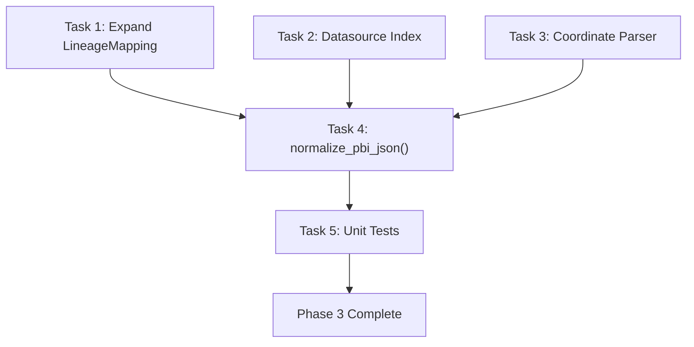

# Phase 3 Implementation Plan: JSON Transformation ("The Bridge")

> **Phase Goal:** Transform the raw Power BI Scanner API JSON into a clean, normalized list of `LineageMapping` objects that map PBI assets to Databricks Unity Catalog tables.

---

## Prerequisites

- [x] Phase 1 complete — authentication working
- [ ] Phase 2 complete — `scan_output.json` produced with endorsed workspace metadata
- [x] `LineageMapping` model defined in `transform.py` skeleton
- [x] `scan_result.json` fixture available for test development

---

## The Transformation Problem

The Scanner API returns a deeply nested JSON structure:

```
scan_result
├── workspaces[]
│   ├── id, name
│   ├── reports[]
│   │   ├── id, name, datasetId, endorsementDetails
│   │   └── (may reference datasets in OTHER workspaces via datasetWorkspaceId)
│   ├── datasets[]
│   │   ├── id, name, endorsementDetails
│   │   ├── tables[]
│   │   │   ├── name, columns[]
│   │   │   └── source[] (M expressions — out of scope)
│   │   ├── datasourceUsages[] → references datasourceInstances by ID
│   │   └── upstreamDataflows[]
│   └── dashboards[]
│       └── tiles[] → reference reportId, datasetId
└── datasourceInstances[]
    ├── datasourceId
    ├── datasourceType (e.g., "Sql", "AzureSQLDB")
    └── connectionDetails
        ├── server (e.g., "myserver.database.windows.net")
        └── database (e.g., "gold_finance")
```

We need to flatten this into:

```json
{
  "pbi_workspace_id": "d507...",
  "pbi_workspace_name": "Finance",
  "pbi_report_id": "c6d0...",
  "pbi_report_name": "Q3 Revenue",
  "pbi_dataset_id": "e7e8...",
  "pbi_dataset_name": "finance_model",
  "endorsement": "Certified",
  "connection_mode": "DirectQuery",
  "databricks_catalog": "gold",
  "databricks_schema": "finance",
  "databricks_table": "revenue",
  "columns": ["amount", "region", "quarter"]
}
```

### The Key Challenge: Resolving Databricks Coordinates

The Scanner API gives us `connectionDetails.server` and `connectionDetails.database` — but we need `catalog.schema.table`. The resolution strategy:

1. **`connectionDetails.server`** → identifies the Databricks workspace (can cross-check against `DATABRICKS_HOST`)
2. **`connectionDetails.database`** → in Databricks SQL, this is `catalog` (or `catalog.schema` depending on configuration)
3. **`dataset.tables[].name`** → the table name within the dataset model

For Databricks-sourced datasets, the connection details follow patterns like:
- Server: `adb-1234567890123456.7.azuredatabricks.net`
- Database: `gold` (catalog) or `gold.finance` (catalog.schema)

When the database field contains a dot, we split into `catalog.schema`. When it doesn't, we use the database as catalog and extract schema from the table name if qualified.

---

## Current State of Codebase

| File | Status |
|------|--------|
| `transform.py` | Skeleton — `LineageMapping` with 5 fields, stub `normalize_pbi_json()` |
| `test_transform.py` | Likely placeholder |
| `scan_result.json` fixture | ✅ Created in Phase 2 |

The existing `LineageMapping` needs to be expanded to match `ARCHITECTURE.md`.

---

## Tasks

### Task 1: Expand `LineageMapping` Model

- **Description:** Update `LineageMapping` in `transform.py` to match the full schema defined in `ARCHITECTURE.md`. Add all required fields for Power BI and Databricks sides.
- **Module:** `src/defensive_lineage/transform.py`
- **Implementation Details:**
  ```python
  class LineageMapping(BaseModel):
      """A single dependency link between a PBI report and a Databricks table."""

      # Power BI side
      pbi_workspace_id: str
      pbi_workspace_name: str
      pbi_report_id: str
      pbi_report_name: str
      pbi_dataset_id: str
      pbi_dataset_name: str
      endorsement: str  # "Certified" | "Promoted"
      connection_mode: str  # "DirectQuery" | "Import" | "Unknown"

      # Databricks side
      databricks_catalog: str
      databricks_schema: str
      databricks_table: str
      columns: list[str]
  ```
- **Acceptance Criteria:**
  - [ ] All 13 fields from `ARCHITECTURE.md` present and typed
  - [ ] Model is frozen (immutable after construction)
  - [ ] Google-style docstring on the class
  - [ ] `mypy --strict` passes
- **Estimated Time:** 0.5 hours
- **Depends On:** None

---

### Task 2: Build Datasource Lookup Index

- **Description:** Create a helper function that builds a lookup dictionary from the `datasourceInstances` array in the scan result, indexed by `datasourceId`. This allows O(1) resolution of connection details when processing datasets.
- **Module:** `src/defensive_lineage/transform.py`
- **Implementation Details:**
  ```python
  def _build_datasource_index(
      datasource_instances: list[dict[str, Any]],
  ) -> dict[str, dict[str, Any]]:
      """Build a lookup dict: datasourceId → datasource instance.

      Args:
          datasource_instances: The top-level datasourceInstances array
              from the scan result.

      Returns:
          Dict mapping datasource IDs to their full instance dicts,
          including connectionDetails.
      """
  ```
- **Acceptance Criteria:**
  - [ ] Returns `dict[str, dict]` keyed by `datasourceId`
  - [ ] Handles empty input → returns `{}`
  - [ ] Handles duplicate IDs → last one wins (with warning log)
  - [ ] Logs count of indexed datasources at `DEBUG`
- **Estimated Time:** 0.5 hours
- **Depends On:** None

---

### Task 3: Implement Databricks Coordinate Parser

- **Description:** Create a function that extracts `catalog`, `schema`, and `table` from a datasource's `connectionDetails` combined with a dataset's `tables[].name`. This is the most complex parsing logic in the entire project.
- **Module:** `src/defensive_lineage/transform.py`
- **Implementation Details:**
  ```python
  @dataclass(frozen=True)
  class DatabricksCoordinate:
      """A resolved catalog.schema.table reference."""
      catalog: str
      schema: str
      table: str

  def _parse_databricks_coordinate(
      connection_details: dict[str, str],
      table_name: str,
  ) -> DatabricksCoordinate | None:
      """Parse Databricks catalog/schema/table from PBI connection details.

      Resolution strategy:
      - database="gold" + table="revenue" → catalog=gold, schema=default, table=revenue
      - database="gold.finance" + table="revenue" → catalog=gold, schema=finance, table=revenue
      - database="gold" + table="finance.revenue" → catalog=gold, schema=finance, table=revenue

      Returns None if parsing fails (non-Databricks source).
      """
  ```
- **Acceptance Criteria:**
  - [ ] Handles `database="catalog"` → uses `"default"` as schema
  - [ ] Handles `database="catalog.schema"` → splits correctly
  - [ ] Handles `table="schema.table"` → splits correctly
  - [ ] Returns `None` for non-Databricks datasources (server doesn't contain `azuredatabricks.net`)
  - [ ] Logs parsing details at `DEBUG`
  - [ ] Pure function — no side effects
- **Risks:**
  - Risk: Connection details format may vary. Mitigation: Log and skip unparseable entries.
  - Risk: Non-Databricks datasources mixed in. Mitigation: Check server hostname pattern.
- **Estimated Time:** 2 hours
- **Depends On:** None

---

### Task 4: Implement `normalize_pbi_json()` Core Logic

- **Description:** Implement the main transformation function that walks the scan result JSON and produces a list of `LineageMapping` objects. This function orchestrates Tasks 2 and 3.
- **Module:** `src/defensive_lineage/transform.py`
- **Input/Output:**
  - Input: Raw scan result dict (from `scanner.get_scan_results()`)
  - Output: `list[LineageMapping]`
- **Implementation Details:**
  ```
  For each workspace:
    For each dataset (already filtered to endorsed):
      Resolve datasource → connection_details via datasource_index
      Detect connection_mode (DirectQuery vs Import via targetStorageMode)
      For each table in dataset:
        Parse Databricks coordinate from connection_details + table.name
        If coordinate is valid:
          For each report referencing this dataset (by datasetId):
            Create LineageMapping(
              pbi_workspace + report + dataset + endorsement + connection_mode
              + databricks coordinate + table columns
            )
  ```
- **Edge Cases to Handle:**
  - Dataset with no `datasourceUsages` → log warning, skip
  - Dataset with `datasourceUsages` referencing unknown ID → log warning, skip
  - Report referencing dataset in a **different workspace** → use `datasetWorkspaceId` field
  - Table with no columns → use empty list `[]`
  - Multiple datasource usages on one dataset → create a mapping for each
- **Acceptance Criteria:**
  - [ ] Produces correct `list[LineageMapping]` from fixture JSON
  - [ ] Handles all 5 edge cases listed above
  - [ ] Logs skipped assets with reasons at `WARNING`
  - [ ] Logs summary counts at `INFO`: total reports, datasets, mappings produced
  - [ ] Zero HTTP calls — pure data transformation
  - [ ] `mypy --strict` passes
- **Estimated Time:** 3 hours
- **Depends On:** Tasks 1, 2, 3

---

### Task 5: Write Unit Tests

- **Description:** Comprehensive test suite for all transformation logic using static JSON fixtures.
- **Module:** `tests/test_transform.py`
- **Test Cases:**

  | # | Test | Scenario |
  |---|------|----------|
  | 1 | `test_normalize_produces_correct_mappings` | Full fixture → correct count and field values |
  | 2 | `test_normalize_skips_unendorsed_datasets` | Dataset without endorsement → not in output |
  | 3 | `test_normalize_handles_multi_table_dataset` | Dataset with 3 tables → 3 mappings per report |
  | 4 | `test_normalize_handles_missing_datasource` | Dataset with unknown datasourceInstanceId → skipped |
  | 5 | `test_normalize_handles_empty_columns` | Table with no columns → `columns: []` |
  | 6 | `test_normalize_handles_empty_input` | Empty workspaces → `[]` |
  | 7 | `test_parse_coordinate_catalog_only` | `database="gold"` → catalog=gold, schema=default |
  | 8 | `test_parse_coordinate_catalog_dot_schema` | `database="gold.finance"` → splits correctly |
  | 9 | `test_parse_coordinate_non_databricks` | Non-Databricks server → returns `None` |
  | 10 | `test_connection_mode_detection` | DirectQuery vs Import → correct `connection_mode` value |
  | 11 | `test_cross_workspace_dataset_reference` | Report references dataset via `datasetWorkspaceId` |
  | 12 | `test_datasource_index_deduplication` | Duplicate datasource IDs → last wins |

- **Acceptance Criteria:**
  - [ ] All 12 tests pass
  - [ ] No HTTP calls in tests
  - [ ] `mypy --strict` passes
- **Estimated Time:** 2.5 hours
- **Depends On:** Tasks 1–4

---

## Execution Order



**Parallel tracks:** Tasks 1, 2, and 3 are independent and can be built simultaneously.

---

## Files Changed Summary

| File | Action |
|------|--------|
| `src/defensive_lineage/transform.py` | **Rewrite** |
| `tests/test_transform.py` | **Rewrite** |

---

## Total Estimated Time

| Task | Hours |
|------|-------|
| Task 1: Expand LineageMapping | 0.5 |
| Task 2: Datasource Index | 0.5 |
| Task 3: Coordinate Parser | 2.0 |
| Task 4: normalize_pbi_json() | 3.0 |
| Task 5: Unit Tests | 2.5 |
| **Total** | **8.5** |

Within the ROADMAP estimate of **6–10 hours**.

---

## Definition of Done (from ROADMAP)

> Running `defensive-lineage transform scan_output.json` produces a clean, validated JSON mapping file.
