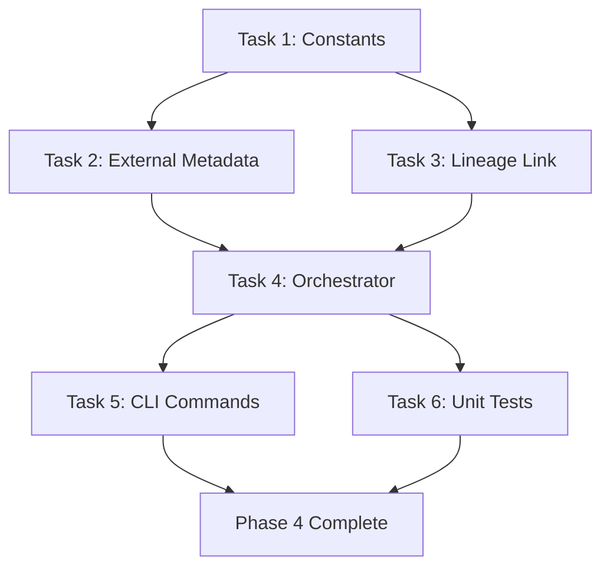

# Phase 4 Implementation Plan: Databricks Unity Catalog BYOL Push ("The Destination")

> **Phase Goal:** Inject the Power BI dependency map into Unity Catalog's lineage graph so PBI reports appear as downstream consumers of Databricks tables in the native UI.

---

## Prerequisites

- [ ] Phase 3 complete — `normalize_pbi_json()` produces `list[LineageMapping]`
- [x] Phase 1 complete — `get_databricks_client()` returns authenticated `WorkspaceClient`
- [ ] SP has `CREATE EXTERNAL METADATA` privilege on the metastore
- [ ] SP has `USE CATALOG` + `USE SCHEMA` on target catalogs

---

## Databricks External Lineage API

Two endpoints inject external lineage:

| Step | Method | Endpoint | Purpose |
|------|--------|----------|---------|
| 1 | `POST` | `/api/2.0/lineage-tracking/external-metadata` | Register PBI assets as external entities |
| 2 | `POST` | `/api/2.0/lineage-tracking/external-lineage` | Link Databricks tables → PBI entities |

### Naming Convention

Deterministic, idempotent names: `powerbi://{workspace_name}/{report_name}`

---

## Tasks

### Task 1: Constants + Naming Helpers
- Define API paths, `SYSTEM_TYPE = "POWERBI"`, and `_build_external_name()` sanitizer
- **Time:** 0.5h | **Depends On:** None

### Task 2: `_create_external_metadata()`
- Register PBI report as external entity via `WorkspaceClient.api_client.do()`
- Handle 409 Conflict as success (idempotent)
- Wrap errors in `PushError`
- **Time:** 2h | **Depends On:** Task 1

### Task 3: `_create_lineage_link()`
- Link Databricks table (source) → PBI entity (target) with column-level mappings
- Handle 409 Conflict gracefully
- **Time:** 2h | **Depends On:** Task 1

### Task 4: `push_lineage()` Orchestrator
- Iterate mappings, create metadata + links, support `dry_run` mode
- Deduplicate metadata creation, continue on individual failures
- Return `PushSummary(total, succeeded, failed, skipped, errors)`
- **Time:** 2h | **Depends On:** Tasks 2, 3

### Task 5: Wire CLI `push`, `dry-run`, `sync` Commands
- `push` loads mappings JSON and pushes; `dry-run` runs full pipeline with no writes; `sync` runs full pipeline
- **Time:** 1.5h | **Depends On:** Task 4

### Task 6: Unit Tests (10 cases)
- Happy path, 409 conflict, API error, dry-run, deduplication, naming, summary counts, column-level lineage
- **Time:** 2.5h | **Depends On:** Tasks 1–4

---

## Execution Order

## Estimated Time: **10.5 hours** (ROADMAP: 10–12h)

## Definition of Done

> After running `defensive-lineage push`, Unity Catalog UI shows PBI dashboards as downstream consumers.
