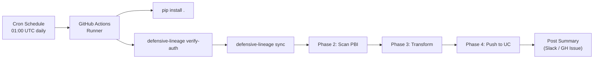
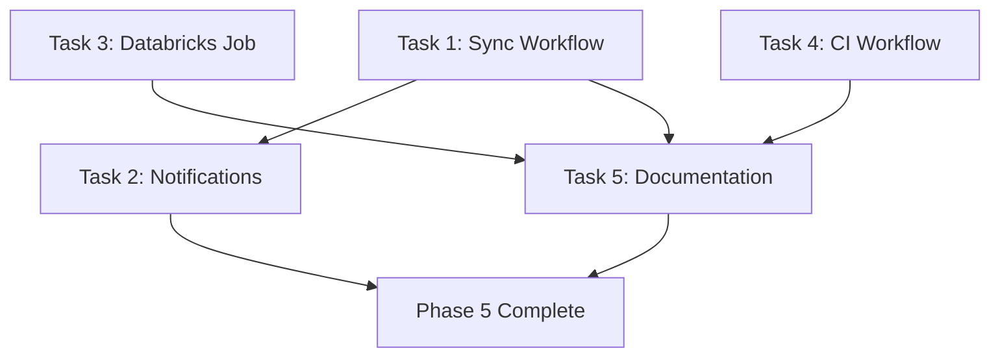

# Phase 5 Implementation Plan: Automation ("Set and Forget")

> **Phase Goal:** Run the full scan → transform → push pipeline automatically on a schedule via GitHub Actions, with no human intervention required.

---

## Prerequisites

- [ ] Phases 1–4 complete — `defensive-lineage sync` works end-to-end locally
- [ ] GitHub repository has Secrets configured for all 6 env vars
- [ ] `pyproject.toml` defines the `defensive-lineage` CLI entrypoint

---

## Architecture



---

## Tasks

### Task 1: Create GitHub Actions Workflow

- **Description:** Create `.github/workflows/sync-lineage.yml` that runs the full pipeline on a cron schedule and on manual dispatch.
- **Module:** `.github/workflows/sync-lineage.yml` (new file)
- **Implementation Details:**
  ```yaml
  name: Sync Lineage
  on:
    schedule:
      - cron: "0 1 * * *"  # Daily at 01:00 UTC
    workflow_dispatch:       # Manual trigger

  env:
    AZURE_TENANT_ID: ${{ secrets.AZURE_TENANT_ID }}
    AZURE_CLIENT_ID: ${{ secrets.AZURE_CLIENT_ID }}
    AZURE_CLIENT_SECRET: ${{ secrets.AZURE_CLIENT_SECRET }}
    DATABRICKS_HOST: ${{ secrets.DATABRICKS_HOST }}
    DATABRICKS_CLIENT_ID: ${{ secrets.DATABRICKS_CLIENT_ID }}
    DATABRICKS_CLIENT_SECRET: ${{ secrets.DATABRICKS_CLIENT_SECRET }}

  jobs:
    sync:
      runs-on: ubuntu-latest
      steps:
        - uses: actions/checkout@v4
        - uses: actions/setup-python@v5
          with:
            python-version: "3.14"
        - run: pip install .
        - run: defensive-lineage verify-auth
        - run: defensive-lineage sync
        - uses: actions/upload-artifact@v4
          with:
            name: scan-output
            path: scan_output.json
            retention-days: 7
  ```
- **Acceptance Criteria:**
  - [ ] Workflow triggers on cron schedule and manual dispatch
  - [ ] All 6 secrets mapped to environment variables
  - [ ] Runs `verify-auth` before `sync` (fail-fast on auth issues)
  - [ ] Uploads `scan_output.json` as a build artifact for debugging
  - [ ] Uses `ubuntu-latest` runner
  - [ ] Python version matches `pyproject.toml` requirement
- **Estimated Time:** 1.5 hours
- **Depends On:** None

---

### Task 2: Add Notification Step (Optional)

- **Description:** Add an optional notification step that posts a summary of the sync run to Slack or creates a GitHub Issue on failure.
- **Module:** `.github/workflows/sync-lineage.yml` (extend)
- **Implementation Details:**
  - On success: Post to Slack webhook with mapping count
  - On failure: Create a GitHub Issue with error logs
  - Controlled by optional secrets (`SLACK_WEBHOOK_URL`)
- **Acceptance Criteria:**
  - [ ] Notification step is conditional — runs only if `SLACK_WEBHOOK_URL` secret exists
  - [ ] On success: posts workspace count, mapping count, duration
  - [ ] On failure: includes error output from the failed step
  - [ ] Workflow still passes if notification step is skipped (no Slack configured)
- **Estimated Time:** 1 hour
- **Depends On:** Task 1

---

### Task 3: Create Databricks Workflow Alternative

- **Description:** Provide a Databricks Workflow job definition as an alternative to GitHub Actions. This is useful for teams that prefer to run the sync within the Databricks platform.
- **Module:** `databricks_job.json` (new file, reference config)
- **Implementation Details:**
  ```json
  {
    "name": "defensive-lineage-sync",
    "tasks": [
      {
        "task_key": "sync_lineage",
        "python_wheel_task": {
          "package_name": "defensive_lineage",
          "entry_point": "main",
          "parameters": ["sync"]
        },
        "libraries": [
          {"pypi": {"package": "defensive-lineage"}}
        ]
      }
    ],
    "schedule": {
      "quartz_cron_expression": "0 0 1 * * ?",
      "timezone_id": "UTC"
    }
  }
  ```
- **Acceptance Criteria:**
  - [ ] Valid Databricks job JSON config
  - [ ] Documents how to set environment variables via Databricks cluster env vars
  - [ ] Includes schedule definition
  - [ ] README section explains both GitHub Actions and Databricks Workflow options
- **Estimated Time:** 1 hour
- **Depends On:** None

---

### Task 4: Add CI/CD Quality Gate Workflow

- **Description:** Create a separate GitHub Actions workflow that runs on every PR: linting, type checking, and tests. This ensures code quality before merge.
- **Module:** `.github/workflows/ci.yml` (new file)
- **Implementation Details:**
  ```yaml
  name: CI
  on:
    pull_request:
    push:
      branches: [main]

  jobs:
    quality:
      runs-on: ubuntu-latest
      steps:
        - uses: actions/checkout@v4
        - uses: actions/setup-python@v5
          with:
            python-version: "3.14"
        - run: pip install -e ".[dev]"
        - run: ruff check src/ tests/
        - run: black --check src/ tests/
        - run: mypy src/
        - run: pytest tests/ -v --tb=short
  ```
- **Acceptance Criteria:**
  - [ ] Runs on every PR and push to main
  - [ ] Runs `ruff`, `black --check`, `mypy`, and `pytest`
  - [ ] Blocks merge if any check fails
  - [ ] Does NOT require API secrets (tests are all mocked)
- **Estimated Time:** 1 hour
- **Depends On:** None

---

### Task 5: Update README and Documentation

- **Description:** Write the final README.md with installation, configuration, usage, and deployment instructions. Update PREREQUISITES.md with GitHub Secrets setup steps.
- **Module:** `README.md`, `.docs/PREREQUISITES.md`
- **Acceptance Criteria:**
  - [ ] README has: project overview, installation, configuration, CLI usage, deployment (GHA + Databricks)
  - [ ] PREREQUISITES.md updated with GitHub Secrets configuration steps
  - [ ] Badge for CI status in README
- **Estimated Time:** 1.5 hours
- **Depends On:** Tasks 1, 4

---

## Execution Order



**Parallel tracks:** Tasks 1, 3, and 4 are independent.

---

## Files Changed Summary

| File | Action |
|------|--------|
| `.github/workflows/sync-lineage.yml` | **Create** |
| `.github/workflows/ci.yml` | **Create** |
| `databricks_job.json` | **Create** |
| `README.md` | **Rewrite** |
| `.docs/PREREQUISITES.md` | **Modify** |

---

## Total Estimated Time

| Task | Hours |
|------|-------|
| Task 1: Sync Workflow | 1.5 |
| Task 2: Notifications | 1.0 |
| Task 3: Databricks Job | 1.0 |
| Task 4: CI Workflow | 1.0 |
| Task 5: Documentation | 1.5 |
| **Total** | **6.0** |

Within the ROADMAP estimate of **4–6 hours**.

---

## Definition of Done (from ROADMAP)

> A push to `main` or a scheduled cron trigger runs the full pipeline end-to-end with no manual steps.

---

## Full Project Timeline Summary

| Phase | Plan | Hours | Status |
|-------|------|-------|--------|
| Phase 1: Auth ("The Bouncer") | `PLAN_PHASE1.md` | 8h | ✅ Complete |
| Phase 2: Scanner ("The Extraction") | `PLAN_PHASE2.md` | 13h | 🔧 In Progress |
| Phase 3: Transform ("The Bridge") | `PLAN_PHASE3.md` | 8.5h | 📋 Planned |
| Phase 4: BYOL Push ("The Destination") | `PLAN_PHASE4.md` | 10.5h | 📋 Planned |
| Phase 5: Automation ("Set and Forget") | `PLAN_PHASE5.md` | 6h | 📋 Planned |
| **Total** | | **46h** | |
